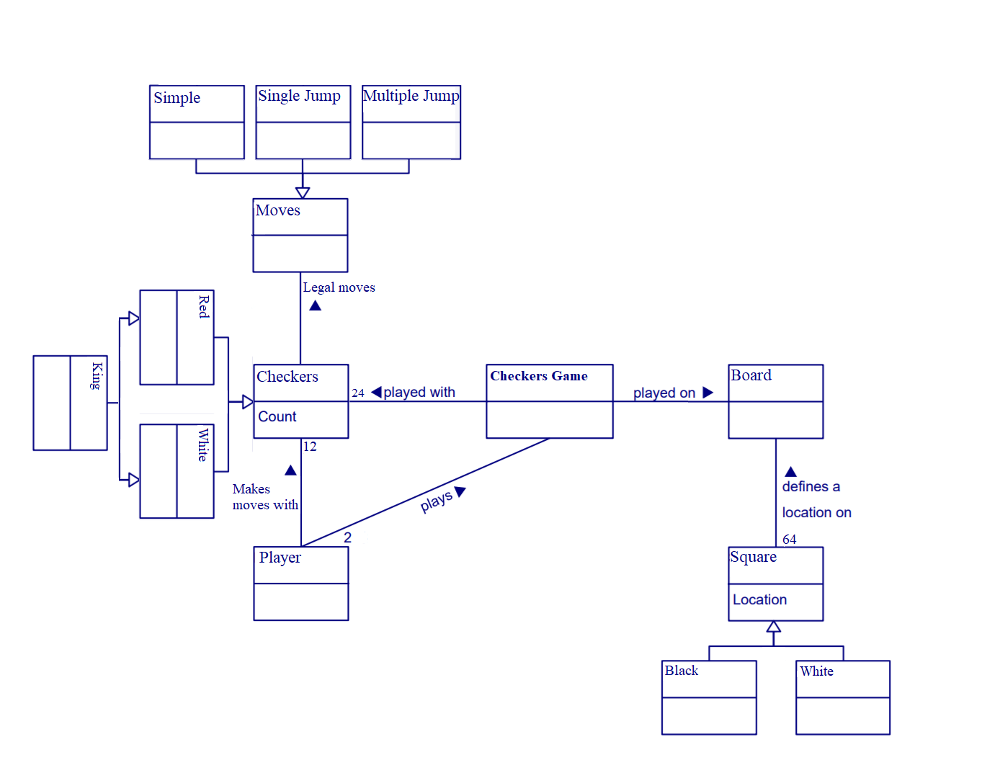
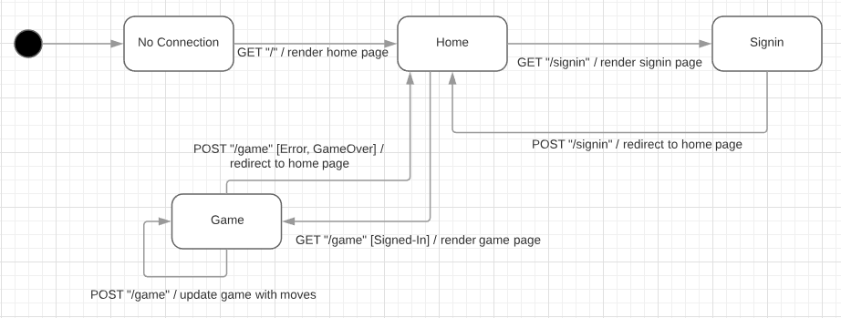

# PROJECT Design Documentation

> _The following template provides the headings for your Design
> Documentation.  As you edit each section make sure you remove these
> commentary 'blockquotes'; the lines that start with a > character
> and appear in the generated PDF in italics._

## Team Information
* Team name: Back of the Bus
* Team members
  * Elijah Parrish
  * Daria Chaplin
  * Alex Hurley
  * Lillian Kuhn
  * Paula Register

## Executive Summary

WebCheckers is an online application that will allow
multiple players to log in and play a game of checkers with one another. The game interface
will support drag and drop browser capabilities for making moves. Beyond this basic
set of features we plan to implement a system so that the players can spectate a game that is 
in progress as well as replay a game they recently played, so that they can further
refine their checker playing skills.

### Purpose
> _The purpose of this project is to provide the players the ablity
to log in and play one another online wherever they are._

### Glossary and Acronyms
> _Provide a table of terms and acronyms._

| Term | Definition |
|------|------------|
| VO | Value Object |

## Requirements

This section describes the features of the application.

> _In this section you do not need to be exhaustive and list every
> story.  Focus on top-level features from the Vision document and
> maybe Epics and critical Stories._

### Definition of MVP
> _Provide a simple description of the Minimum Viable Product._

### MVP Features
> _Provide a list of top-level Epics and/or Stories of the MVP._

### Roadmap of Enhancements
> _Provide a list of top-level features in the order you plan to consider them._

## Application Domain

This model shows the general domain of the project

> The central entity of our application is the Checkers game, which is played on a board.
The board is defined by Squares, which are in turn defined by their color and location. 
The checkers game is played with the pieces and played by the player. The player makes moves
that can be defined by the type of piece that is being moved and the type of move
that the piece is making.   

## Architecture and Design

This section describes the application architecture.

### Summary

The following Tiers/Layers model shows a high-level view of the webapp's architecture.

As a web application, the user interacts with the system using a
browser.  The client-side of the UI is composed of HTML pages with
some minimal CSS for styling the page.  There is also some JavaScript
that has been provided to the team by the architect.

The server-side tiers include the UI Tier that is composed of UI Controllers and Views.
Controllers are built using the Spark framework and View are built using the FreeMarker framework.  The Application and Model tiers are built using plain-old Java objects (POJOs).

Details of the components within these tiers are supplied below.

### Overview of User Interface

This section describes the web interface flow; this is how the user views and interacts
with the WebCheckers application.

> _Provide a summary of the application's user interface.  Describe, from
> the user's perspective, the flow of the pages in the web application.
The flow of the web pages from the user's perspective is as follows: When the user opens the home page
they first see a simple welcome message and a button to sign in, they will also be presented
with the number of players who are signed in. When they click to sign in they will be redirected to the Signin
page where they can post their username. They will then be redirected to home. If they then click 
the name of another player then both players will be redirected to the game screen 
where they can play the game of checkers. Once a winner has been decided they will be redirected to the home
screen._

### UI Tier
> _Provide a summary of the Server-side UI tier of your architecture.
> Describe the types of components in the tier and describe their
> responsibilities.  This should be a narrative description, i.e. it has
> a flow or "story line" that the reader can follow._

> _At appropriate places as part of this narrative provide one or more
> static models (UML class structure or object diagrams) with some
> details such as critical attributes and methods._

> _You must also provide any dynamic models, such as statechart and
> sequence diagrams, as is relevant to a particular aspect of the design
> that you are describing.  For example, in WebCheckers you might create
> a sequence diagram of the `POST /validateMove` HTTP request processing
> or you might show a statechart diagram if the Game component uses a
> state machine to manage the game._

> _If a dynamic model, such as a statechart describes a feature that is
> not mostly in this tier and cuts across multiple tiers, you can
> consider placing the narrative description of that feature in a
> separate section for describing significant features. Place this after
> you describe the design of the three tiers._

### Application Tier
> _Provide a summary of the Application tier of your architecture. This
> section will follow the same instructions that are given for the UI
> Tier above._

### Model Tier
> _Provide a summary of the Application tier of your architecture. This
> section will follow the same instructions that are given for the UI
> Tier above._

### Design Improvements
> _Discuss design improvements that you would make if the project were
> to continue. These improvement should be based on your direct
> analysis of where there are problems in the code base which could be
> addressed with design changes, and describe those suggested design
> improvements. After completion of the Code metrics exercise, you
> will also discuss the resutling metric measurements.  Indicate the
> hot spots the metrics identified in your code base, and your
> suggested design improvements to address those hot spots._

## Testing
> _This section will provide information about the testing performed
> and the results of the testing._

### Acceptance Testing
> _Report on the number of user stories that have passed all their
> acceptance criteria tests, the number that have some acceptance
> criteria tests failing, and the number of user stories that
> have not had any testing yet. Highlight the issues found during
> acceptance testing and if there are any concerns._

### Unit Testing and Code Coverage
> _Discuss your unit testing strategy. Report on the code coverage
> achieved from unit testing of the code base. Discuss the team's
> coverage targets, why you selected those values, and how well your
> code coverage met your targets. If there are any anomalies, discuss
> those._
