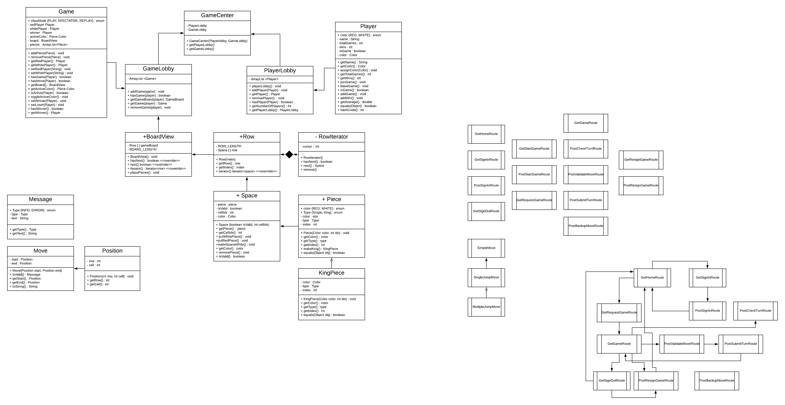
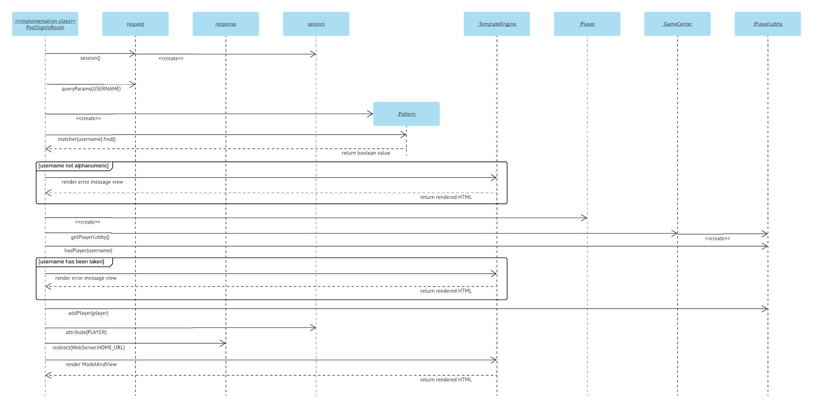
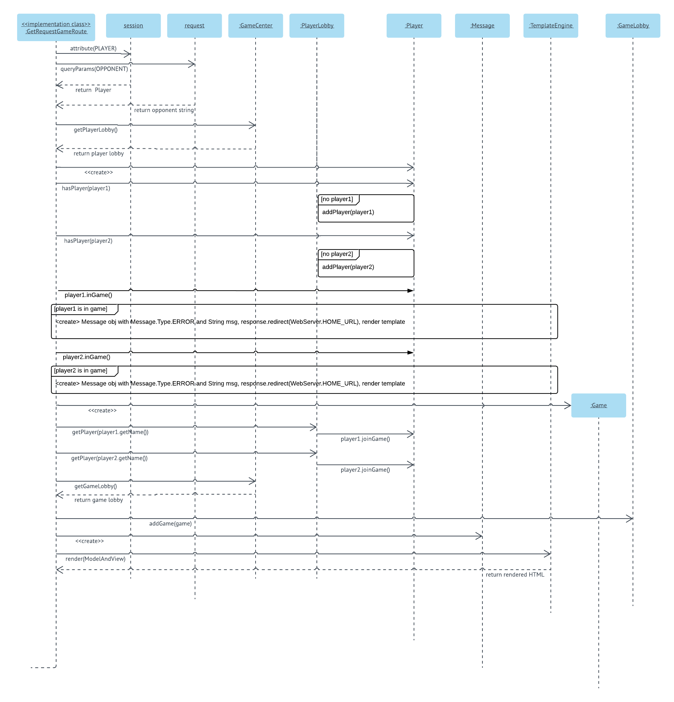

# PROJECT Design Documentation

## Team Information
* Team name: Back of the Bus
* Team members
  * Daria Chaplin
  * Alex Hurley
  * Lillian Kuhn
  * Paula Register

## Executive Summary

WebCheckers is an online application that will allow
multiple players to log in and play a game of checkers with one another. The game interface
will support drag and drop browser capabilities for making moves. Beyond this basic
set of features we plan to implement a system so that the players can spectate a game that is 
in progress as well as replay a game they recently played, so that they can further
refine their checker playing skills.

### Purpose
> The purpose of this project is to provide the players the ablity
to log in and play one another online wherever they are.

### Glossary and Acronyms
> _Provide a table of terms and acronyms._

| Term | Definition |
|------|------------|
| VO | Value Object |
| BV | BoardView    |
|Player| A user who is signed in|

## Requirements

>This application allows users to play a game of checkers.

### Definition of MVP
> The application will allow different users to sign in and play a game of checkers
over the web. A user may choose an opponent from a list of available
players, and the 2 players will be sent to a game of checkers. The game plays
according to the American rules, except that the most complex move available
must be made at each turn. Moving regular pieces and kings works the same
as in the classic American rules. A winner is declared when one player 
captures all of their opponent's pieces or one player forces their opponent
into a position where they have no valid moves available. Either player
can resign from the game during their turn. 

### MVP Features
* Sign-In
* Sign-Out
* Resign
* Start Game
* Win Game
* Make a Move

### Roadmap of Enhancements
* Spectator Mode
    * A third person may watch 2 other players play a game
* Replay Mode
    * Players may rewatch the games they just finished playing

## Application Domain

This model shows the general domain of the project

> The central entity of our application is the Checkers game, which is played on a board.
The board is defined by Squares, which are in turn defined by their color and location. 
The checkers game is played with the pieces and played by the player. The player makes moves
that can be defined by the type of piece that is being moved and the type of move
that the piece is making.   

## Architecture and Design

This section describes the application architecture.

### Summary

The following Tiers/Layers model shows a high-level view of the webapp's architecture.

As a web application, the user interacts with the system using a
browser.  The client-side of the UI is composed of HTML pages with
some minimal CSS for styling the page.  There is also some JavaScript
that has been provided to the team by the architect.

The server-side tiers include the UI Tier that is composed of UI Controllers and Views.
Controllers are built using the Spark framework and View are built using the FreeMarker framework.  The Application and Model tiers are built using plain-old Java objects (POJOs).

Details of the components within these tiers are supplied below.

### Overview of User Interface

This section describes the web interface flow; this is how the user views and interacts
with the WebCheckers application.

>The flow of the web pages from the user's perspective is as follows: When the user opens the home page
they first see a simple welcome message and a button to sign in. They will also be presented
with the number of players who are signed in. When they click to sign in they will be redirected to the Signin
page where they can post their username. They will then be redirected to home where, if they
signed in successfully, they will see a list of other players names. 
If they then click the name of another player then both players will be 
redirected to the game screen where they can play the game of checkers.
Once a winner has been decided they will be redirected to the home
screen. If either player resigns during the game, both players will be redirected
to the homepage.

### UI Tier

> When a user signs in, they are directed back to the home screen, 
and they see a list of possible opponents. They are considered 'waiting for
a game' until they select an opponent or they are selected as an opponent.
When 2 users enter a game, they take turns submitting moves. Moves 
are validated and submitted through their respective routes, and the
player's turn is finished when a move is submitted successfully and 
reflected back to the user through the checkTurn route which is updated 
every 5 seconds. 

### Application Tier

> The application consists simply of the Game- and PlayerLobby which 
track the users currently online and the active games. The GameCenter 
class in the Application tier contains the Game- and PlayerLobby.

### Model Tier

> The base class for the Model is the game. Within the game, we have two 
BoardViews representing the renderings for each player. Each BoardView
is made of a collection of Rows, which are a collection of Spaces. The
spaces can be white or black, and may contain a piece. The pieces may be
single or king and their moving capabilities depend on whether or not they
are kings.

### Design Improvements
> _Discuss design improvements that you would make if the project were
> to continue. These improvement should be based on your direct
> analysis of where there are problems in the code base which could be
> addressed with design changes, and describe those suggested design
> improvements. After completion of the Code metrics exercise, you
> will also discuss the resulting metric measurements.  Indicate the
> hot spots the metrics identified in your code base, and your
> suggested design improvements to address those hot spots._

> Originally, we had the Piece and Player classes implementing their own
Color enumerations which made comparisons difficult in the long run.
We switched to a public enumeration in the model package because the
player's color was essentially the color of pieces they were assigned.
There should be some abstractions in the Model tier which have not yet
been flushed out, but would absolutely contribute to the effectiveness
of the design.

## Testing
> _This section will provide information about the testing performed
> and the results of the testing._

> Our unit testing strategy has essentially been to broadly test all of 
the class's methods first, creating mock Objects to test with and creating
 real objects only when necessary. Once those methods have been guaranteed
  to work, we isolated specific user stories and use cases. For example, we
   tested the game logic of edge cases for the Red and White players 
   throughout many of the classes, since we wanted to guarantee that all of
    the logic worked for both players.

### Acceptance Testing
> _Report on the number of user stories that have passed all their
> acceptance criteria tests, the number that have some acceptance
> criteria tests failing, and the number of user stories that
> have not had any testing yet. Highlight the issues found during
> acceptance testing and if there are any concerns._

>We achieved a code coverage of 98% for the application tier, 84% for the 
UI tier, and 82% for the model tier. We were initially planning on aiming 
a bit higher for the UI tier and especially the model tier, but due to time
 constraints and the complicated logic in the Move mode object in particular,
  we fell slightly short of our initial coverage targets.

### Unit Testing and Code Coverage
> _Discuss your unit testing strategy. Report on the code coverage
> achieved from unit testing of the code base. Discuss the team's
> coverage targets, why you selected those values, and how well your
> code coverage met your targets. If there are any anomalies, discuss
> those._

> Our initial coverage targets were to have 90%+ coverage for the UI tier
 and 95%+ coverage for the model tier. Since the model objects are used
  extensively throughout the application and most of our business logic 
  fell in this tier, we felt it was important to most thoroughly test the
   model tier. Despite falling slightly short of our original goals, the 
   code coverage meets our targets fairly well. In the model tier, it is
    mostly the Move object lacking some coverage and we will improve on 
    this drastically in upcoming development.

