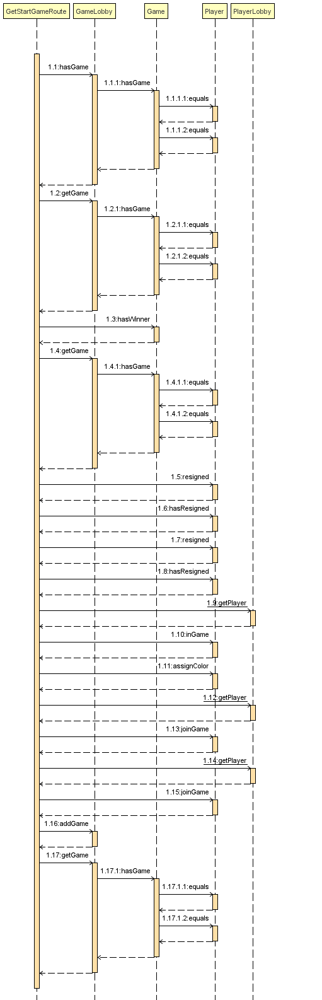

# PROJECT Design Documentation

> _The following template provides the headings for your Design
> Documentation.  As you edit each section make sure you remove these
> commentary 'blockquotes'; the lines that start with a > character
> and appear in the generated PDF in italics._

## Team Information
* Team name: Back of the Bus
* Team members
  * Daria Chaplin
  * Alex Hurley
  * Lillian Kuhn
  * Paula Register

## Executive Summary

WebCheckers is an online application that will allow
multiple players to log in and play a game of checkers with one another. The game interface
will support drag and drop browser capabilities for making moves. Beyond this basic
set of features we plan to implement a system so that the players can spectate a game that is 
in progress as well as replay a game they recently played, so that they can further
refine their checker playing skills.

### Purpose
> The purpose of this project is to provide the players the ability
to log in and play one another online wherever they are.

### Glossary and Acronyms

| Term | Definition |
|------|------------|
| VO | Value Object |
| BV | BoardView    |
| Player | A user who is signed in|

## Requirements

>This application allows users to play a game of checkers.

### Definition of MVP
> The application will allow different users to sign in and play a game of checkers
over the web. A user may choose an opponent from a list of available
players, and the 2 players will be sent to a game of checkers. The game plays
according to the American rules, except that the most complex move available
must be made at each turn. Moving regular pieces and kings works the same
as in the classic American rules. A winner is declared when one player 
captures all of their opponent's pieces or one player forces their opponent
into a position where they have no valid moves available. Either player
can resign from the game during their turn. 

### MVP Features
* Sign-In
* Sign-Out
* Resign
* Start Game
* Win Game
* Make a Move

### Roadmap of Enhancements
* Spectator Mode
    * A third person may watch 2 other players play a game
* Replay Mode
    * Players may rewatch the games they just finished playing

## Application Domain

>This model shows the general domain of the project

> The central entity of our application is the Checkers game, which is played on a board.
The board is defined by Squares, which are in turn defined by their color and location. 
The checkers game is played with the pieces and played by the player. The player makes moves
that can be defined by the type of piece that is being moved and the type of move
that the piece is making.   

## Architecture and Design

>This section describes the application architecture.

### Summary

>The following Tiers/Layers model shows a high-level view of the webapp's architecture.

>As a web application, the user interacts with the system using a
browser.  The client-side of the UI is composed of HTML pages with
some minimal CSS for styling the page.  There is also some JavaScript
that has been provided to the team by the architect.

>The server-side tiers include the UI Tier that is composed of UI Controllers and Views.
Controllers are built using the Spark framework and View are built using the FreeMarker framework. 
 The Application and Model tiers are built using plain-old Java objects (POJOs).

>Details of the components within these tiers are supplied below.

### Overview of User Interface

> The flow of the web pages from the user's perspective is as follows: When the user opens the home page
they first see a simple welcome message and a button to sign in, they will also be presented
with the number of players who are signed in. When they click to sign in they will be redirected to the Signin
page where they can post their username. They will then be redirected to home. If they then click 
the name of another player then both players will be redirected to the game screen 
where they can play the game of checkers. Once a winner has been decided they will be redirected to the home
screen.Inside of the game there will be the option to sign out or resign, both of which will result in that player 
forfeiting the game to the other player, returning them back to the home page. Additionally if there are
other games going on they will be displayed on the homepage for a signed in user to see. Upon clicking
on a game in the list the user will be redirected to the spectator page of the game between the two players,
the user will be able to exit at any time by clicking the exit button._

### UI Tier

> It all starts at GetHomeRoute this is the first thing the user will see
as it displays the homepage. Before even signing in users are able to 
see the number of current players. From the homepage the user is given
the option to signin which will invoke GetSignInRoute. GetSignInRoute displays 
the signin.ftl page which has a user input box where they can input their username.
Once the user inputs their username then PostSignInRoute is invoked. PostSignIn
then requests the user input and checks to see that it meets the conditions. If 
it passes all of the conditions the player is added to the playerLobby and the 
page is redirected to GetHomeRoute again. In the homepage, if the user is signed in
and there are other players in games, these games will be displayed on a list on the 
homepage, if the user clicks on the game it invokes GetSpectateGameRoute, which 
redirects them to the board view as a spectator. The spectator page is refreshed
every five seconds by the PostSpectateGameRoute, which checks if a player has submitted 
a turn. Additionally the spectator can exit the game at any time by clicking the exit
button which invokes the GetLeaveSpectateRoute which simply returns the Spectator back
to the home page. Additionally at the homepage the user can see other players, 
and can click on their username to invoke GetRequestGameRoute, which checks if the
requested player is already in a game or not, if so then it redirects to homepage,
and returns an error message, otherwise a It calls to GetGameRoute with a hashmap
of all the necessary information, inside of GetGameRoute the gameboard is displayed
and it checks whether or not the player is in the game or has resigned. Inside of 
the game If the user chooses to resign, PostResignRoute is called, inside of 
Resign the player who initiates the resignation is set as the loser, and removed 
from the game, and redirected to GetHomeRoute and the opposing player is then set
as the winner of the game, removed from the game and redirected to GetHomeRoute as 
well. Inside of a game when a player clicks signout PostResignGameRoute is also called, 
but the player is also removed from playerLobby therefore effectively deleting the 
instance of that player. If a player signs out from outside of a homepage then 
GetSignOutRoute is also called upon in which the player is simply removed from the
playerLobby and effectively removed from the server, then redirected to 
GetHomeRoute.

<!---
[link to sequence diagram][1]
[link to second sequence diagram][2]
[link to UML Diagram and statechart][3]
[1]:https://www.lucidchart.com/invitations/accept/2b3504e3-8f91-4bd9-a148-9be0395c4971 "Title"
[2]:https://www.lucidchart.com/invitations/accept/1530ef9f-49d6-461c-b51e-3e344254318a "Title"
[3]:https://www.lucidchart.com/invitations/accept/b08abbb6-b75e-4da0-997a-94b82652cbb8 "Title"

> _At appropriate places as part of this narrative provide one or more
> static models (UML class structure or object diagrams) with some
> details such as critical attributes and methods._
--->

> When a user signs in, they are directed back to the home screen, 
and they see a list of possible opponents. They are considered 'waiting for
a game' until they select an opponent or they are selected as an opponent. 
Additionally, if there is an ongoing game, then a user who is signed in
has the option to spectate a  game. There will be a list of ongoing games
with the game name being a concatenation of the two players names. The 
spectator will have the option to exit the game at any point. When 
2 users enter a game, they take turns submitting moves. Moves 
are validated and submitted through their respective routes, and the
player's turn is finished when a move is submitted successfully and 
reflected back to the user through the checkTurn route which is updated 
every 5 seconds. 

### Application Tier
> Our application tier is made up of three different classes:
GameCenter, GameLobby, and PlayerLobby. GameLobby is where the game objects are 
stored and we can access the games, searching by player etc. The playerLobby 
is where the Player objects are stored we can use this to access and store
players. GameCenter is a unification of both PlayerLobby and GameLobby
so that you can access all the methods under both from just one Class.

### Model Tier
> Our Model tier is the meat of this project. It includes eleven 
 classes. Boardview is what actually displays and puts together the board
 it puts both the spaces and pieces into the gameboard effectively making 
 the board which the player sees. Color is an enumeration class that is used
 when instantiating a color for both Players and Pieces. Game requires two 
 players to instantiate Game holds all of the information pertaining to the game, 
 it holds the two players and their colors it is also where a loser and winner 
 are declared. KingPiece changes a piece to the status of a king piece, it enables
 that piece to have more functionality over other pieces in the game. Message is 
 used for return types inside of the UI tier when sending Json information. It 
 requires a Type (error or info) and a string identifying what was happening
 Move controls the movement of the various pieces in the gameboard. It has a 
 start and end index being where the piece started and where it ends up after 
 the move will be made. The piece class make the piece object that is being 
 moved by the player. It can be identified with a color and type ie. RED,KING.
 The Player class makes a player object. The player object represents the player
 making the moves and controlling all of the actions. The player type stores 
 the number of wins, name of the player, total number of games and a boolean
 value representing whether or not the player is in a game or not. Position is 
 needed for the move class. It is the index of a specific place on the gameboard
 it stores the row and cell of a certain place. Row makes the row object 
 which is what the gameboard is made out of. The rows are made up of spaces.
 Space represents the smallest measurement unit in the gameboard. It is a single 
 square in the gameboard Spaces store a piece and a color of the specific space.

### Design Improvements

> Originally, we had the Piece and Player classes implementing their own
Color enumerations which made comparisons difficult in the long run.
We switched to a public enumeration in the model package because the
player's color was essentially the color of pieces they were assigned.
There should be some abstractions in the Model tier which have not yet
been flushed out, but would absolutely contribute to the effectiveness
of the design. There were many architectural improvements done over the 
course of sprint 3. We used to have 3 routes that all functioned together
in handling the refreshing and creation of a game: GetGameRoute, GetRequestGameRoute,
and GetStartGameRoute. This caused some redundancy and was sloppy coding,we 
decided to condense the functionality of these three routes into a singular 
route being GetStartGameRoute. By combining the functionality into a single route 
we were better able to track down various bugs and errors, this was a very large
restructuring and helped us tremendously. We also revamped our Resign routes by
deleting PostResignRoute. This route was also rather redundant and served no 
viable purpose.

## Testing

> Our unit testing strategy has essentially been to broadly test all of 
the class's methods first, creating mock Objects to test with and creating
 real objects only when necessary. Once those methods have been guaranteed
  to work, we isolated specific user stories and use cases. For example, we
   tested the game logic of edge cases for the Red and White players 
   throughout many of the classes, since we wanted to guarantee that all of
    the logic worked for both players.

### Acceptance Testing
> We achieved a code coverage of 98% for the application tier, 84% for the
 UI tier, and 82% for the model tier. We were initially planning on aiming
  a bit higher for the UI tier and especially the model tier, but due to 
  time constraints and the complicated logic in the Move mode object 
in particular, we fell slightly short of our initial coverage targets.

### Unit Testing and Code Coverage

>Our initial coverage targets were to have 90%+ coverage for the UI tier
 and 95%+ coverage for the model tier. Since the model objects are used
  extensively throughout the application and most of our business logic
   fell in this tier, we felt it was important to most thoroughly test 
   the model tier. Despite falling slightly short of our original goals,
    the code coverage meets our targets fairly well. In the model tier, 
    it is mostly the Move object lacking some 
coverage and we will improve on this drastically in upcoming development.

### Sequence Diagrams

>GetstartGameRoute begins with requesting the current player from the session
it then checks if the player is already in a game and if so then it checks if
the game has already had a declared winner if true then returns back to homepage 
else then it retrives the game from gamelobby and returns the most current game 
settings. otherwise it attempts to make a new game and retrieves the opponent 
player from the query params then checks if that person is in a game, if so 
it returns an error message, otherwise it makes a new game with the current player 
and the opponent. It retrieves the information on the opponent from the queryparams 
it then returns the game.

>PostSignInRoute begins by requesting the username of the player from queryparams
It then checks for white spaces and not alphanumeric enterings, and rejects those
inputs with an error. it then checks the playerlobbby to see if a player with that
username already exists, if so it returns an error. If the username passes all of
those conditionals then a new player is made and added to the playerlobby the current
player attribute is sent to getstartgameroute and then the page is redirected to the 
homepage.

### Code Metrics 

>In order to calculate class metrics and further analyze our code, we used
 the IntelliJ plugin MetricsReloaded. Several findings from this are important
  to highlight. The cyclomatic complexity metrics pointed out three classes as
   outliers: BoardView, GetHomeRoute, and GetStartGameRoute.

  

>As this histogram shows, the majority of our classes are well within reasonable
 values of complexity. BoardView, upon further examination, has many execution paths
  because the for each loops used for board set-up iterate through each space and
   check for space color repeatedly. The complexity could be decreased by adjusting
    these loops to be plain for loops that step through every other space. As far as
     the routes go, these simply need to have some functionality moved elsewhere rather
      than checking game status through many if blocks.

>Our Javadoc method coverage illuminated a few spots needing improvements as well.

>Every class which has 0% javadoc method coverage is a test class. Many of these
 classes are highly readable on their own. Additionally, the handful of classes with
  50% or so coverage has comments for accessor and mutator methods. However, it is
   important to have standard, formal method javadocs for each method for accessibility,
    so this should be fixed in further updates, including test classes.

>Another valuable set of metrics that we examined was the Martin package metrics. This
 showed mainly average values. One outlier was the efferent coupling value for the UI
  package: 85 classes within the UI tier depended on outside classes. This would be an
   issue with high-level design that could provide difficulty with future maintainability as well
    as re-usability if left alone. However, with full MVP functionality, we would not
     recommend over-turning the current overall design of the program. Unless a great deal
      of further work would need to be completed, the effort would outweigh the benefits.